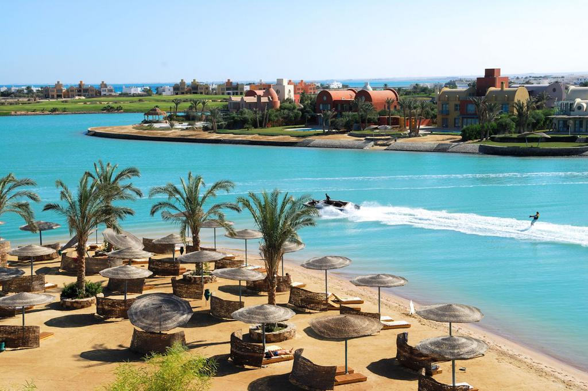
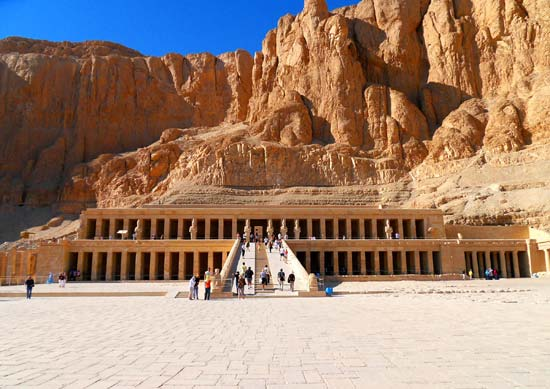

# Welcome to Egypt!

---
## A two in one experience with Luxor an hurghada.

  
## Why you should visit? 
---
Are you a fan of history, a mind of curiosity to be challenged by the prehistoric structures of luxor?  
Or desperate for a beautiful holiday with impeccable climate?  
Egypt is your **paradise**!
## The best of Luxor
1. The valley of the kings and **Queen Hatsheputs temple**
 
A mysterious place of wonder with 62 empy, unidentified tombs and king Tutankhamun's safehouse of a coffin. 

2. Karnak temples

Find out more about the temple of the Egyptian God - Amunrah- built by....well we don't know.

3. River Nile Boat Trip

take a ride down the longest river of africa, a river surviving centuries of ancient Egypt

4. luxor temples
![]